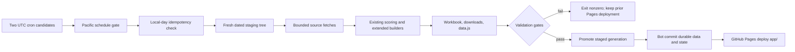

# Daily Refresh Operations

The dashboard uses one transactional Python command and GitHub Actions to fetch bounded current data, rebuild all public artifacts, validate the complete generation, commit durable last-known-good state, and deploy the static `app/` directory. The fishing model, weights, uncertainty language, source attribution, observed/forecast/climatology distinctions, and deliberate long-range nulls are unchanged.

## Architecture



`pipeline/run_daily_refresh.py` is the only supported daily entry point. It creates a same-filesystem staging tree, preserves committed historical baselines, fetches only recent or due data, runs existing scoring code, builds every output, validates it, and promotes only after success. Network writes are atomic; generated legacy outputs are safe because they occur only inside staging.

## Local commands

Create a Python 3.12 virtual environment and install the exact dependency versions:

```bash
python3.12 -m venv .venv
source .venv/bin/activate
python -m pip install -r requirements.txt
```

No-network dry run (validates the committed snapshot against its own build date):

```bash
python pipeline/run_daily_refresh.py --dry-run
```

Real daily refresh:

```bash
python pipeline/run_daily_refresh.py
```

Useful operator modes:

```bash
python pipeline/run_daily_refresh.py --force
python pipeline/run_daily_refresh.py --force --full-rebuild
python pipeline/run_daily_refresh.py --force --no-promote --keep-stage
python -m unittest discover -s tests -v
```

`--full-rebuild` forces due checks and recomputes derived tables from the retained baselines. It intentionally does not redownload all historical NDBC, CO-OPS, or MUR data. Historical backfill remains a manual maintenance operation.

## Pacific schedule and DST

GitHub runs two candidate schedules:

- `30 15 * * *`, which is 08:30 during PDT and 07:30 during PST.
- `30 16 * * *`, which is 09:30 during PDT and 08:30 during PST.

At job start, `pipeline/schedule_gate.py` converts the actual UTC time with `zoneinfo.ZoneInfo("America/Los_Angeles")`. A scheduled candidate continues only at or after 08:15 local time and only when `.refresh-cache/daily_state.json` does not already record a successful refresh for that Pacific date. During PST the 07:30 candidate normally exits and the 08:30 candidate runs. During PDT the 08:30 candidate runs and the 09:30 candidate exits cheaply after seeing the first run's persisted success. If GitHub queues either candidate late, it remains eligible for the rest of that local day instead of being discarded by a narrow time window. `workflow_dispatch` bypasses the schedule gate, while the orchestrator still honors same-day idempotency unless `force=true` is selected.

The 08:30 target is an operational balance: it gives overnight dock totals and morning NOAA/NWS/Open-Meteo products more time to appear while keeping the forecast useful for the current fishing day. MUR is allowed to use and disclose the latest prior valid daily field because same-day analysis can still be unpublished in the morning. `.refresh-cache/daily_state.json` remains a second idempotency check inside the orchestrator, and workflow concurrency prevents overlapping runs.

## Source cadence and stale-data behavior

| Source | Check cadence | Fetch policy | Freshness and fallback |
| --- | --- | --- | --- |
| NOAA NDBC realtime stations | Daily run | Current rolling text only; historical archives are retained | Fresh through 3 hours, delayed through 12 hours, then stale. A bad station response never replaces valid history. |
| NOAA CO-OPS water temperature and pressure | Daily run | Seven-day rolling overlap, within product window limits | Fresh through 3 hours, delayed through 12 hours, then stale. Station/time keys are deduplicated and prior data remain available. |
| NOAA CO-OPS harmonic predictions | Daily run | Refresh a 40-day window | Clearly labeled harmonic predictions. Cached predictions are accepted only while they still cover at least the required 30-day horizon. |
| NASA JPL MUR SST through CoastWatch ERDDAP | Daily run | Nine zone requests, strictly sequential, seven-day overlap | Probe today backward for the newest published field. Fresh through one local day old, delayed through three days, then stale. Same-day absence is nonfatal if the latest valid field is retained and labeled. |
| NWS forecasts | Daily run | Discover and fetch the latest official SGX Coastal Waters Forecast product for current zones PZZ740/PZZ745 with a descriptive User-Agent | Issuance time, minimum content, and zone coverage are validated. Empty or malformed responses do not replace good files. The narrative is a cross-check; degenerate coastal land-grid wave output remains unusable marine-wave data. |
| Open-Meteo marine and atmosphere | Daily run | Bounded near-term and 16-day requests for nine zones | Required date coverage and parseability are validated. Days 15-30 still publish no deterministic wind or swell projections. |
| CPC 8-14 day outlook | Daily | Extract in staging, sample the San Diego proxy point, then retain only the compact sample and source URL | Latest successful issue is recorded; nationwide shapefiles never enter durable Git history. |
| Weekly Niño 3.4 and CPC week 3-4 | Weekly | Check only when due | Prior valid product is retained and marked `not_due`, delayed, or cached as appropriate. |
| ONI and CPC monthly/seasonal outlooks | Monthly | Check only when due | CPC land-temperature outlook remains a regional warm/cool lean, not a direct offshore SST forecast. |
| San Diego dock totals | At most daily | Cache raw HTML metadata and merge parsed records by natural key | Parser/page change cannot clear, truncate, or duplicate catch history. Failure retains prior records and is reported. Attribution and non-commercial framing remain. |

Machine-readable status is written to `dataset/csv/source_status.json`, embedded in `app/data.js`, staged at `app/downloads/csv/source_status.json`, and rendered in the dashboard header and Data & Sources tab. It separates dashboard build time from each source observation or issuance time.

The persistent `.refresh-cache` contains only bounded rolling responses, compact CPC point samples, provenance, and local-day state. Large national CPC GIS archives are deleted from staging after their validated San Diego sample is built, preventing routine Git growth while preserving the exact model input needed on a `not_due` or failed-fetch day.

Scheduled bot commits persist canonical `dataset/csv/` tables, compact cache/state, `app/data.js`, build reports, and generated documentation. The workbook and duplicate `app/downloads/` copies are rebuilt and included in the Pages artifact but are not committed on every daily run; this avoids accumulating two large binary copies while preserving reproducibility from the canonical CSVs.

## Validation and publication

`pipeline/validate_build.py` blocks publication for:

- Missing, empty, malformed, or implausibly small required outputs.
- Duplicate natural keys in current, score, tide, or extended tables.
- Historical row-count or date-span regression.
- Scores outside 0-100.
- Missing nine-zone near-term coverage or an incomplete 30-day outlook.
- Deterministic projected wind/swell leakage into lead days 15-30.
- Confidence-tier boundary drift: the seven-day view is zero-based lead 0-6, tier 2 is lead 7-14, and tier 3 is lead 15-30.
- Missing site payload keys or static assets.
- Download hashes that differ from canonical CSVs.
- Workbook sheet loss or row-count mismatch.
- A deployment-critical source failure without a last-known-good fallback.

A station-level or noncritical source outage may deploy only when retained data and status metadata are honest and every structural validation passes. A failed run never reaches `actions/deploy-pages`, so the previous successful GitHub Pages deployment remains live.

## GitHub setup

1. Keep `.github/workflows/daily-refresh.yml` on the default branch.
2. In **Settings > Actions > General**, allow GitHub Actions and permit read/write workflow permissions. The workflow itself requests only `contents: write` for refresh and `pages: write` plus `id-token: write` for deployment.
3. In **Settings > Pages > Build and deployment**, choose **GitHub Actions** as the source.
4. Run **Actions > Daily dashboard refresh > Run workflow** once with `dry_run=true`.
5. Run it again with defaults. Verify a `chore(data): daily refresh YYYY-MM-DD PT` commit and a successful `github-pages` environment deployment.
6. Add branch protection that allows `github-actions[bot]` to push generated refresh commits, or use a dedicated generated-data branch if organization rules prohibit bot pushes to the default branch.

The workflow runs only on `schedule` and `workflow_dispatch`, so its bot commit cannot recursively trigger itself.

### Private repository alternative

GitHub Pages availability for private repositories depends on the account plan. If the source must remain private without an eligible Pages plan, use a Cloudflare Pages Free **Direct Upload** project so the same validated `app/` workspace is uploaded; do not use a repository-triggered Cloudflare rebuild because daily workbook/download mirrors are intentionally not committed.

1. Create a Direct Upload Pages project in Cloudflare and keep all paid add-ons disabled.
2. Create a narrowly scoped API token with `Account / Cloudflare Pages / Edit`.
3. Add GitHub Actions secrets `CLOUDFLARE_API_TOKEN` and `CLOUDFLARE_ACCOUNT_ID`, plus repository variable `CLOUDFLARE_PROJECT_NAME`.
4. Replace the `deploy` job's GitHub Pages step with `npx wrangler pages deploy app --project-name "$CLOUDFLARE_PROJECT_NAME"` and pass those two secrets as `CLOUDFLARE_API_TOKEN` and `CLOUDFLARE_ACCOUNT_ID`.
5. Keep the existing `needs.refresh`, success condition, and `should_deploy` condition so Cloudflare receives only a fully validated generation.

No Worker, Durable Object, database, paid add-on, or always-on service is needed. Do not enable both deployment paths unless duplicate deployment is intentional.

## Rollback, pause, and diagnostics

- **Rollback:** revert the generated-data bot commit to a known-good commit, then manually run the workflow with `dry_run=false` only if a new fetch is desired. For an immediate site rollback, redeploy the `app/` artifact from a known-good revision through Pages.
- **Pause:** disable the workflow from its Actions page or remove/comment the two `schedule` entries. Manual dispatch remains available if only the cron entries are removed.
- **Diagnostics:** failures retain the previous live site and upload `build-report.json` plus `source_status.json` for seven days. Non-sensitive errors are capped in the status artifact.
- **Idempotency reset:** use `force=true` for a deliberate same-day rerun. Do not delete historical CSVs to force refresh.

## Cost and terms

Expected recurring cost is **$0/month** for a low-traffic public repository using standard GitHub-hosted Actions and GitHub Pages within free quotas. Cloudflare Pages Free is the preferred static alternative when private-source Pages is unavailable. Costs can arise from exceeding private-repository Actions minutes/storage, enabling paid Pages/Cloudflare features, unusually large Git history, or adding paid APIs. Avoid those features, retain diagnostics for only seven days, and monitor repository growth.

Continue to display NOAA/NASA/Open-Meteo/CPC attribution and the dock source's non-commercial-use framing. Public data availability does not remove source-specific attribution, access, or usage obligations.
